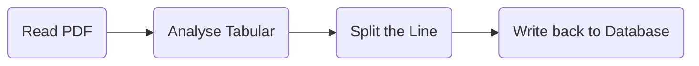

# About `word Booster`

## Develop Documentation

### Data Collection && Analysis

In the file named `data_process.py`， I used a straightforward way to
implement the function to get words from a `PDF`. The material `pdf` 
was provided by my former English teacher which include the highest 
frequency in daily English use. Thanks for her file, I passed almost
every English test with no troubles on vocabulary.

In `Python`, there are some useful package to analyse `pdf` file, I 
choosed `pdfplumber` because of its advantages on `tabular` analysis.
In `pdfplumber`'s view, a `pdf` file has its structure as following:

```angular2html
    pdfplumber.PDF.metadata
                  .pages.page_number
                        .width
                        .height
                        .objects/.chars/.lines/.rects/  这些属性中的每一个都是一个
                        .curves/.figures/.images        列表，并且每个列表针对嵌入
                                                        面上的每个此类对象包含一个
                                                        字典。
```

So, the workflow of my project about data collection is that:



After the procedures above, we successfully make a database.

## 